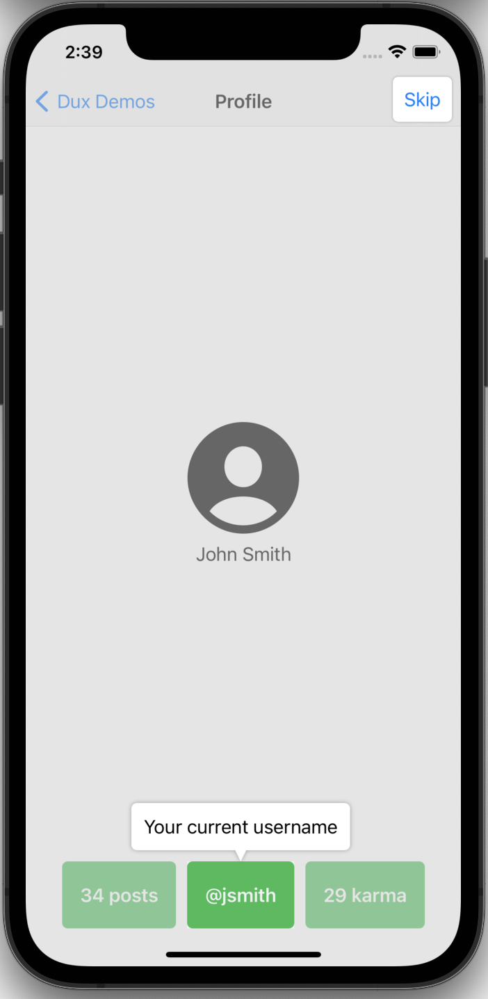

# Dux

Guide users through your SwiftUI app with coach marks.



## Installation

In `Package.swift`:

```swift
dependencies: [
    .package(url: "https://github.com/jakeheis/Dux", .upToNextMajor(from: "0.0.1"))
]
```

## Usage

```swift
@main
struct MyApp: App {
    var body: some Scene {
        WindowGroup {
            DuxContainerView {
                MyView()
            }
        }
    }
}

struct MyView: View {
    enum Tags: DuxTags {
        case hello
        
        func makeCallout() -> Callout {
            .text("This is a message saying hello")
        }
    }
    
    var body: some View {
        VStack {
            Text("Hello world")
                .duxTag(Tags.hello)
        }
        .dux(isActive: true, tags: Tags.self)
    }
}
```

See the `Examples` directory for examples of how to use `Dux`.

## Attributions

Inspired by https://github.com/ephread/Instructions
